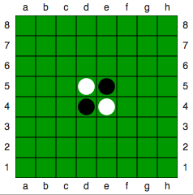
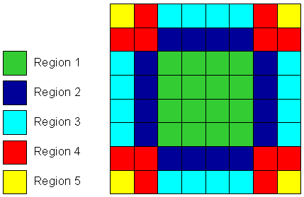

# Reversi (aka Othello)

## 1. State of the art
* https://www.lri.fr/~hansen/proceedings/2011/GECCO/companion/p739.pdf
* http://www.xiaotu.com/pub/ChonS05a.pdf
* http://gamelearninglab.nctu.edu.tw/ctsun/GA%20learning%20in%20game%20playing.pdf

## 2. Problem definition

### 2.1. Reversi rules
Reversi is a two-player strategy board game played with pieces (or disks), which are light on one side and dark on the other. Each player has one color assigned to him. The goal of the game is to have the majority of disks turned to display your color when the game ends. Reversi rules are as follows:
* game is played on a 8x8 board
* game starts with two light and two dark pieces on board, positioned in the center, see image below:
 

* dark player is the first to move
* during player's turn, the player places a piece on the board, his colour up. A piece must be placed on a square adjacent to opposing player's piece in such a way, that at least one opposing piece is captured
* capture occurs when there is a straight line (horizontal, vertical or diagonal) between a piece that is being placed on the board and any other piece owned by the acting player, with at least one opposing player's piece in between. The pieces in beetween are turned over
* if a player to act has no available moves to make he passes
* game ends when both players have no available moves to make, whoever has the majority of pieces in his colour wins

### 2.2. Problem
The aim of this project is to autmate the process of finding the optimal strategies for Reversi game. A torunament platform for Reversi strategies will be created.

### 2.3. Strategies
#### 2.3.1. Non-parametrized
* Random moves - sefl-explanatory
* Greedy algorithm - makes moves that yield the most points at a given time

#### 2.3.2. Parametrized
1. Stable discs - aims to capture squares that can't be recaptured
    Parameters:
    * stable-disk-weight - capture stable disk or capture something that yields more points
    
    Value range - [0, 1] - 1 always capture stable, 0 always capture for points

1. Corners - aims to capture board corners
    Parameters:
    * number-of-corners-to-capture
    
    Value set - {1, 2, 3, 4}

1. Positional - based on risk map, aims to capture low-risk squares and aviod high-risk squares
    Parameters:
    * risk-map - array of 5 integers - risk value for each region
        
    Value set for each region - {0, 1, .. , 99 }
    
    

1. Mobility - aims to make such moves that maximize number of your moves and minimize number of opponent's moves
    Parameters:
    * maximize - decide whether to maximize self moves or minimize opponent's moves
    
    Value range - [0, 1] - 1 always maximize self moves, 0 always minimize opponent's moves

1. Mixed strategy - used one strategy at first, changes to another strategy when condition is met
    Parameters:
    * strategy1 - strategy to use at the beginning of the game
    * changeCondition - number of moves to make before changing strategy
    
    Value set - { 1, 2, .. , 19 }
    * strategy2 - strategy to use after changeCondigion in met

## 3. Software documentation

## 4. Testing plan

## 5. Results
