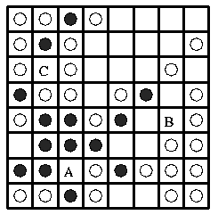

# Reversi (aka Othello)

LOGO AGH I JAKIŚ WSTĘP
## 1. State of the art
co tutaj?

## 2. Problem definition

### 2.1. Reversi rules
Reversi is a two-player strategy board game played with pieces (or disks), which are light on one side and dark on the other. Each player has one color assigned to him. The goal of the game is to have the majority of disks turned to display your color when the game ends. Reversi rules are as follows:
* game is played on a 8x8 board
* game starts with two light and two dark pieces on board, positioned in the center, see image below:

 

* dark player is the first to move
* during player's turn, the player places a piece on the board, his colour up. A piece must be placed on a square adjacent to opposing player's piece in such a way, that at least one opposing piece is captured
* capture occurs when there is a straight line (horizontal, vertical or diagonal) between a piece that is being placed on the board and any other piece owned by the acting player, with at least one opposing player's piece in between. The pieces in beetween are turned over
* if a player to act has no available moves to make he passes
* game ends when both players have no available moves to make, whoever has the majority of pieces in his colour wins

### 2.2. Problem
The aim of this project is to autmate the process of finding the optimal strategies for Reversi game. A torunament platform for Reversi strategies will be created.

### 2.3. Strategies
#### 2.3.1. Non-parametrized
* Random moves - sefl-explanatory
* Greedy algorithm - makes moves that yield the most points at a given time

#### 2.3.2. Parametrized
1. Stable discs - aims to capture squares that can't be recaptured
    
    Parameters:
    * stable-disk-weight - capture stable disk or capture something that yields more points
    
    Value range - [0, 1] - 1 always capture stable, 0 always capture for points
    
    Value step - 0.1

    

    A, B, C - are stable fields for white disc.

1. Corners - aims to capture board corners
    
    Parameters:
    * number-of-corners-to-capture
    
    Value set - {1, 2, 3, 4}

1. Positional - based on risk map, aims to capture low-risk squares and aviod high-risk squares
    
    Parameters:
    * risk-map - array of 5 integers - risk value for each region
        
    Value set for each region - {0, 1, .. , 99 }
    
    

1. Mobility - aims to make such moves that maximize number of your moves and minimize number of opponent's moves
    
    Parameters:
    * maximize - decide whether to maximize self moves or minimize opponent's moves
    
    Value range - [0, 1] - 1 always maximize self moves, 0 always minimize opponent's moves
    
    Value step - 0.1

1. Mixed strategy - used one strategy at first, changes to another strategy when condition is met
    
    Parameters:
    * strategy1 - strategy to use at the beginning of the game
    * changeCondition - number of moves to make before changing strategy
    
    Value set - { 0, 1, 2, .. , 19 } - 0 indicates that only strategt 1 should be used throughout the game
    * strategy2 - strategy to use after changeCondigion in met
    
### 2.4 Problem solving proposition - coś z solving ma być
#### 2.4.1 Model
Each strategy will be represented as an agent containing to following properties:
* gamesPlayed [int] - number of games played by the stratgy agent
* gamesWon [int] - numbers of games won
* earlyGameStrategy [strategy] - strategy that should be used from the start of the game
* strategySwitchPoint [int] - number indicating after how many moves should the agent change strategy to lateGameStrategy - if the value is 0, only earlyGameStrategy should be used throughout the game
* lateGameStrategy [strategy] - strategy that should be used when {strategySwitchPoints} moves are made

#### 2.4.2 Initial population
* 5 strategies - 2 non-parametrized, 3 parametrized
* each parametrized - 8 different parameter sets
* 26 singular strategies + 34 randomly mixed multiple strategies
* 60 strategies in total

#### 2.4.3 Agent "mutation" - mutation mieliśmy uyżyć
If at any point disturbance of agent's strategies is to be performed, a decision tree determines the details of the disturbance. The decistion tree requires the following parameters:
* disturbEarlyGameStrategyChance
* replaceEarlyGameStrategyChance
* disturbStrategySwitchPointChance
* useOnlyEarlyGameStrategyChance
* disturbLateGameStrategyChance
* replaceLateGameStrategyChance
The decision tree has the following structure:
```
DisturbAgentsStrategies(disturbEarlyGameStrategyChance, replaceEarlyGameStrategyChance,
        disturbStrategySwitchPointChance, useOnlyEarlyGameStrategyChance,
        disturbLateGameStrategyChance, replaceLateGameStrategyChance)
{
    # check to see if distirbance should be performed
    if random(0,1) > win%
        # check to see whether to disturb earlyGameStrategy
        if random(0,1) < disturbEarlyGameStrategyChance
            # check to see whether to disturb parameters or change strategy
            if random(0.1) < replaceEarlyGameStrategyChance
                ChangeStrategy(earlyGameStrategy)
            else
                DisturbParameters(earlyGameStrategy)

        # check to see whether to disturb strategySwitchPoint
        if random(0,1) < disturbStrategySwitchPointChance
            if random(0,1) < useOnlyEarlyGameStrategyChance
                strategySwitchPoint = 0
            else
                strategySwitchPoint = random(1,20)
        # check to see whether to disturb lateGameStrategy
        if random(0,1) < disturbLateGameStrategyChance
            # check to see whether to disturb parameters or change strategy
            if random(0.1) < replaceLateGameStrategyChance
                ChangeStrategy(lateGameStrategy)
            else
                DisturbParameters(lateGameStrategy)
}            
```

## 3. Software documentation
### 3.1 Structure
Software code is entirely written in Java and is divided into 3 packages - engine, algorithm, and tournament. Engine package contains tools for playing Reversi games between two playes. Abstraction for player algorithms is also in engine package. Algorithm package contains concrete implementations of player algorithms. Tournament package contains platform for performing tournaments to determine the best of the strategies implemented in algorithm package.

### 3.2 Game engine
The game engine can use various alghoritms to play. The game state is computing using board evaluation.

### 3.3 Algorithms
Alghorithms are strategies, which decide how to play (choos moves to play). Also there is one alghoritm which can play two different strategies. First one in some determine number of moove, and later the second one.

Algorithms also can mutate some strategies, change their parameters or even combine two diferent one.

### 3.4 Tournament engine
The tournament engine can compete players against each others and select the best players of tournament.

## 4. Testing plan
### 4.1 Initial population
[Initial population same as in 2.4.2](#2-4-2-initial-population)

### 4.2 Tournament selection
#### 4.2.1 Child and parents succession
In each iteration, do 20 times:
* randomly chose two 10-strategies sets
* two round-robin rounds in each set
* best-of-two match between each strategy - starting strategies alternate
* two winning strategies populate and together with their child advance to next iteration

#### 4.2.2 Only child succession
In each iteration, do 60 times:
* randomly chose two 10-strategies sets
* two round-robin rounds in each set
* best-of-two match between each strategy - starting strategies alternate
* two winning strategies populate, but only their child advances to next iteration

### 4.3 Mutation
Before winning strategies populate:
* decide whether to mutate (disturb) specimens based on its winning precentage
* if mutation is to occur, specimens' stats (games played, games won) are rest

### 4.4 Determining winners
After a set number of iterations a list of all surviving specimen is sorted by win percentage in a descending manner. Should there be any specimen within (subject to change) 5% win rate margin, a second tournament in performed.

## 5. Results
### 5.1 Experiment 1
Expriment details:
* population size: 60
* iterations: 15
* tournament size: 8

#### 5.1.1 Only child succession
* total number of of matches: 50400

As early as in 4th iteration the whole population consists of only positional strategy players.

#### 5.1.2 Parents and child succession
* total number of of matches: 16800

Positional strategy players still dominate. This time the population consists of 100% positional strategy players as late as in 9th iteration.

#### 5.1.3 Experiment 1 conclusion
Positional strategy players dominate tournaments. Due to lack of mutation all winning positional strategy players advance to next iterations unchanged, which results in population containing only positional strategy players quickly.

### 5.2 Experiment 2
Experiment details:
* population size: 60
* iterations: 50
* tournament size: 10

#### 5.2.1 Only child succession
* total number of of matches: 270000

Positional strategy players still dominate all match-ups. Positional strategy players occupy the top of the leaderboard as early as fifth iteration, but don't take up over 50% of the population until 13th iteration.

#### 5.2.2 Parents and child succession
* total number of of matches: 90000

Positional strategy players are at the top of the population already after 2nd iteration. This time, because of the fact that parents as well as a child advance to next iteration, positional strategy players make for over 70% of the population aftert 3rd iteration.

#### 5.2.3 Experiment 2 conclusion
Introduction of mutation allowed for population to bo more diversified during most of the experiment in case of only child succession. Child and parents succession introduced a kind of elitism, where most of the players advancing to next iterations are positional strategy players. Mutation ensures they never make for 100% of the population.

### 5.3 Experiment 3
Experiment details:
* population size: 60
* iterations: 30
* tournament size: 5

#### 5.3.1 Only child succession
* total number of of matches: 36000

#### 5.3.2 Parents and child succession
* total number of of matches: 12000

### 5.4 Experiment 4
Experiment details:
* population size: 50
* iterations: 30
* tournament size: 5
* extra: positional strategy excluded

Positional strategy players dominated all previous experiments. This experiment was performed to find out how other strategies cope against each other.

#### 5.4.1 Only child succession
* total number of of matches: 30000

#### 5.4.2 Parents and child succession
* total number of of matches: 10000

## 6. Sources/Bibliography
* Application to play Reversi. Genetic algorithms to moves. Each player makes random moves. Genetic algorith to search best moves in own move's history. Different depth search. (Reversi on 10x10 board)
  * https://www.lri.fr/~hansen/proceedings/2011/GECCO/companion/p739.pdf
* Article about learn coupyter Othello strategies without expert knowledge. Using two ways, neural network and min-max search alghoritm. Individual neural network discoverd variuos game-playing strategies, e.g. positional, and later mobility (after 1000 generations).
  * http://www.xiaotu.com/pub/ChonS05a.pdf
* Playing Reversi also with Genetic Algorithms. Main purpose, show that learn player (choos) from large "strategies" set is better than from small one.
  * http://gamelearninglab.nctu.edu.tw/ctsun/GA%20learning%20in%20game%20playing.pdf
* Develop new strategies to play Othello based on artificial evolution of neural network. New strategies play against random-moves and αβ-search. Neural network quickly learn positional and mobility strategies.
  * http://nn.cs.utexas.edu/downloads/papers/moriarty.discovering.pdf
* Note briefly describing LOGISTELLO, one of the today's strongest Othello program.
  * http://citeseerx.ist.psu.edu/viewdoc/download?doi=10.1.1.114.1746&rep=rep1&type=pdf
* This article has shown how Othello programs evolved from classic hand-tuned to sophisticated learning systems which have surpassed human playing strength.
  * https://skatgame.net/mburo/ps/compoth.pdf
