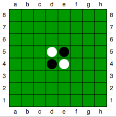

# Zasady Gry
1. Gra toczy się pomiędzy dwoma graczami (czarny i biały) na planszy 8x8. Do gry potrzebne są 64 dwukolorowe piony (z jednej storny białe, z drugiej czarne).
2. Gra zaczyna się z dwoma białymi oraz dwoma czarnymi pionami ustawionymi na planszy jak poniżej. Grę rozpoczynają piony czarne.

  

3. Gracz umieszcza na planszy pion zwrcony swoim kolorem do góry. W polu, które styka się z co najmniej jednym pionem przeciwnika. Tak, aby zdobyć co najmniej jeden pion przeciwnika. Piony zdobywa się poprzez obrócenie pionów kolorem gracza wykonującego ruch do góry. Odwraca się wszystkie piony umiejscowione pionowo, poziomo oraz na skos między nowo postawionym pionem, a innym pionem gracza.
4. Postawionych pionów nie można z planszy usuwać, ani przemieszczać. Dozwolone jest tylko obracanie piona, w celu zmiany koloru.
5. Gra toczy się dopóki gracz może wykonać ruch.
6. Wygrywa ten gracz, który posiada więcej pionów swojego koloru na planszy. Jeśli na koniec gry pozostały wolne pola na planszy są one doliczane do wyniku gracza ktoóry wygrał.Jezżeli obaj gracze mają taką samą liczbę pionw na planszy obróconą swoim kolorem do góry jest remis.
    - Istnieje wariant gry anty-reversi. Odbywa się na tych samych zasadach, jednak cel gry jest przeciwny. Wygrywa gracz z najmniejszą ilością "swoich" pionów na planszy.
    - Czy najlepsze strategie dla Reversi będą równierz najlepsze dla Reversed-Reversi

## Pytania
- Co z blokowaniem ruchow? Gracz specjalnie może grać tak by móc wykonać dwa ruchy pod rząd. Ma to sens?